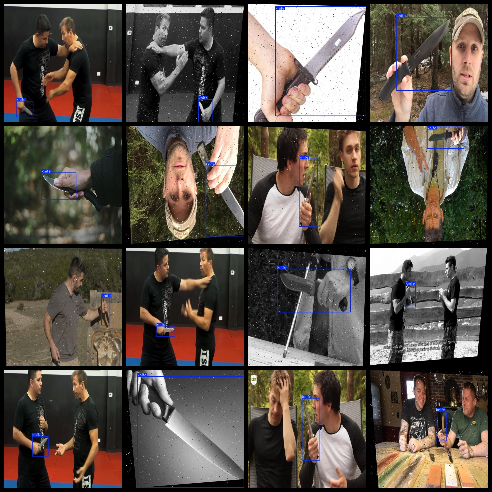
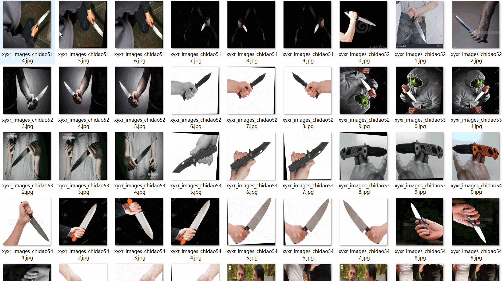

# Hold Knife Detection Dataset 4920 imagesVOC+YOLO（(Augmented) ）

Knife holding test dataset 4920 VOCs + YOLOs (enhanced)

Dataset Description: The dataset contains many images that have been enhanced through video screenshots, making up a significant proportion. Images with a knife held in hand are not individual knife images.

Dataset Format: VOC format + YOLO format

The compressed file contains: three folders, each storing images, xml files, and text files.

Total jpg images in JPEGImages folder: 4920

The total number of XML files in the Annotations folder: 4920.

The total number of txt files in the labels folder is 4920.

Number of tag types: 1

Tag names: ["knife"]

The number of boxes for each label (Note that the order of labels in the Yolo format does not correspond to this, but is based on the classes.txt file in the labels folder):

knife frame count = 5005

Total boxes: 5005

Picture clarity (Resolution: Pixels): Clear

Images augmented: Yes

GitHub Repository Location: datasets_sl

Shape of the label: Rectangular box, used for object detection and recognition.

Important Note: None

Special Notice: This dataset does not guarantee the accuracy or precision of the trained models or weight files. The dataset only provides accurate and reasonable annotations.

Annotation and image details are as follows:

## Images

---

Here is a pay link on Stripe (https://buy.stripe.com/3cs8yP7sY87d0vu9AB). Please contact me lonlonago@foxmail.com after funding $89, and I will send you a complete data files, thank you!

